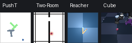

# envX

envX puts four accelerator-oriented RL environments behind one batch-first,
Gymnax-shaped interface:



| Name | Simulator | Default observation | Action |
| --- | --- | --- | --- |
| `pusht` | Pure JAX rigid-body/contact solver | 5-D state | absolute XY target |
| `two-rooms` | Pure JAX point/collision solver | 10-D state | XY displacement |
| `reacher` | DMC Reacher model with JAX/MJX physics | 6-D DMC state | two torques |
| `cube` | OGBench Cube with MJX-Warp | OGBench state | 5-D end-effector control |

The implementations and required Cube assets live in this repository. The
standalone PushT, Two-Room, Reacher, and OGBench forks are not runtime
dependencies.

## One interface

```python
import jax

import envx

env, params = envx.make("pusht", num_envs=4096)
observation, state = env.reset(jax.random.key(0), params)
action = env.sample_actions(jax.random.key(1), params)
observation, state, reward, done, info = env.step(jax.random.key(2), state, action, params)
```

Every registry environment exposes the same methods:

```text
reset(key, params) -> observation, state
step(key, state, action, params) -> observation, state, reward, done, info
rollout(key, state, actions, params) -> final_state, trajectory
sample_actions(key, params) -> action
action_space(params)
observation_space(params)
```

Observations, actions, rewards, done flags, and info leaves carry a leading
`num_envs` dimension. A reset or step takes one root JAX key; envX splits it
internally where independent per-world keys are required. `rollout` expects time-major actions with shape
`(time, num_envs, *action_shape)` and places the dependent time loop inside one
compiled `jax.lax.scan`.

`step` deliberately keeps terminal states instead of silently auto-resetting.
This differs from Gymnax's convenience auto-reset but makes the four backends
consistent and avoids hiding terminal observations from replay buffers. Every
`info` contains `success`, `terminated`, `truncated`, and `discount`, in
addition to environment-specific metrics.

## Installation

Python 3.11 or 3.12 is supported. On macOS, the JAX and MJX-Warp CPU backends
support development, correctness tests, and offline rendering:

```bash
git clone git@github.com:fracapuano/envX.git
cd envX
uv sync --python 3.11 --extra dev
uv run pytest
```

macOS does not provide a JAX GPU backend. For large batches, install on Linux
with an NVIDIA GPU and select the matching wheel:

```bash
uv sync --python 3.11 --extra cuda12 --extra dev
# or: uv sync --python 3.11 --extra cuda13 --extra dev
uv run python -c "import jax; print(jax.devices())"
```

PushT and Two-Room run with ordinary JAX on CPU, GPU, or TPU. Reacher supports
MJX-JAX for validation and MJX-Warp for high-throughput simulation. Cube
requires MJX-Warp because its mesh contacts are unsupported by the older
MJX-JAX collision backend.

## Environment configuration

Static simulator and observation choices are passed through `make`:

```python
pusht, pusht_params = envx.make(
    "pusht", num_envs=1024, observation_type="pixels", observation_size=96
)

rooms, rooms_params = envx.make(
    "two-rooms",
    num_envs=4096,
    observation_type="pixels",
    visualize_goal=False,
)

reacher, reacher_params = envx.make(
    "reacher",
    num_envs=4096,
    task="easy",
    observation_type="states",
    physics_backend="warp",
    render=False,
    visualize_goal=False,
)

cube, cube_params = envx.make(
    "cube",
    num_envs=1024,
    env_type="single",
    observation_type="states",
    task_ids=0,
)
```

`task_ids=0` makes each Cube world sample one of OGBench's five task layouts.
A scalar ID from 1 through 5 fixes the layout. Cube also supports `double`,
`triple`, `quadruple`, and `octuple` variants.

The Two-Room PLDM/EB-JEPA variant is available as `two-rooms-pldm` and is
included in `envx.registered_environments(include_variants=True)`.

## Goal pixels and dataset compatibility

Two-Room and Reacher default to `visualize_goal=False`. Their goals remain in
state and determine success, reward, and distance, but are not drawn in pixels.
Set the flag to true only when the source dataset also contains the marker or
for debugging. PushT and Cube keep their established visual contracts.

The original environment-specific helpers remain importable:

```python
from envx.pusht import reset_from_dataset_state
from envx.tworooms import state_from_swm_observation
from envx.reacher import ReacherEnv
from envx.cube import OGBenchCubeJaxEnv
```

## Compiled trajectories

```python
action_keys = jax.random.split(jax.random.key(3), 100)
actions = jax.vmap(lambda key: env.sample_actions(key, params))(action_keys)
final_state, trajectory = env.rollout(jax.random.key(4), state, actions, params)
jax.block_until_ready(trajectory)

print(trajectory.observation.shape)
print(trajectory.reward.shape)  # (100, num_envs)
```

Compilation and static render/contact buffers make `num_envs`, image sizes,
and simulator variants construction-time choices. Create a separate env object
for each static configuration used by a training job.

## Visual rollouts

Generate reproducible random-policy GIFs for all four environments and a
labeled four-column animation:

```bash
uv run python examples/visualize_rollout.py all \
  --output-dir rollouts --steps 60 --image-size 128 --seed 7
```

On macOS the Reacher and Cube images use MJX-Warp's CPU validation renderer;
their training-time fast batched rendering path is CUDA. Two-Room and Reacher
keep goal markers hidden in this example, matching their default dataset-safe
configuration.

## Validation

```bash
uv run ruff check .
uv run ruff format --check .
uv run pytest
uv build
```

The test suite includes the original physics, task, dataset, and rendering
checks from all four implementations, plus common-interface and packaged-asset
tests. Native DMC and OGBench comparisons remain part of the macOS suite.

See `NOTICE` and `THIRD_PARTY_LICENSES.md` for source revisions and licenses.
